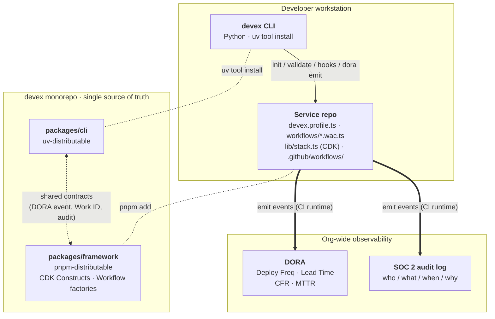

# devex — Golden Path Ecosystem

> Shared engineering tooling that homologates the development lifecycle across 10+ polyglot teams **without putting the platform team in the critical path**.

`devex` is a two-product ecosystem — a Python CLI for developers and a TypeScript framework for service repos — that turns the "Golden Path" from a policy document into something **a new repo can adopt with one command**.

| Product | Language | Distribution | Audience |
|---|---|---|---|
| `devex-cli` | Python 3.11+ | `uv tool install` from Git | **Developers** — local validation, scaffolding, Git hooks |
| `@devex/framework` | TypeScript 5+ | `pnpm add` from Git | **Service repos** — CDK Constructs + GitHub Actions workflow factories |

---

## The "wow moment" — what adopting the framework gets you

The reference project [`transactionify`](https://github.com/rrgarciach/transactionify) is a real Python Lambda + API Gateway + DynamoDB service. Its `lib/transactionify-stack.ts` is **187 lines** of repeated CDK boilerplate: 5 Lambdas × (function + grant + integration + route) plus tags hardcoded inline.

A consumer fork demonstrating the refactor lives at [`JynLeazy1/transactionify`](https://github.com/JynLeazy1/transactionify). After adopting `@devex/framework`, the same Stack drops to **73 lines** — a **60% reduction** — and gains:

- **Multi-environment support** (sandbox / staging / prod, each a separate Stack)
- **FinOps tag enforcement** via CDK Aspect (missing tag → `cdk synth` warning or error)
- **A full 5-stage PR pipeline** (~240 lines of YAML) auto-generated from a 23-line `.wac.ts` file
- **Python 3.12 by default** (the original was stuck on 3.9, EOL October 2025)
- **DORA & audit events** matching a shared schema (TS ⇄ Python lockstep)

```
Before                                After
──────                                ─────
187 lines of inline CDK    →    73 lines using PythonLambdaApi
Tags repeated 6× inline    →    1 typed `tags: GoldenPathTags` prop
Python 3.9 (deprecated)    →    Python 3.12 enforced
No CI/CD workflows         →    5-job PR pipeline from a .wac.ts file
No DORA emission           →    Cross-language DoraEvent at every stage
No multi-env support       →    3 stacks (sandbox/staging/prod) from one file
```

> See [`JynLeazy1/transactionify`](https://github.com/JynLeazy1/transactionify) for the full refactored consumer (multi-env stack, `.wac.ts` workflows, generated YAML).

---

## Quick start

### Install the CLI

```bash
uv tool install "git+https://github.com/JynLeazy1/devex@v0.1.0#subdirectory=packages/cli"
devex --version
```

> **Pin explicitly.** The command above pins to `v0.1.0`. Installing from `main` without a tag/SHA produces silent version drift across developers — different adopters can end up scaffolding incompatible `devex.profile.ts` shapes. The Golden Path is reproducible only with explicit refs.

> Prerequisite: `uv` (modern Python package manager from Astral).
> `curl -LsSf https://astral.sh/uv/install.sh | sh`

### Scaffold a new repo in 1 command

```bash
mkdir my-service && cd my-service && git init
devex init --team platform
```

Output:

```
Inferred service name from directory: 'my-service'
warning: no --repo-url provided and no 'origin' remote configured;
         using placeholder 'https://github.com/TODO-org/my-service'.
+ devex.profile.ts
+ workflows/pr.wac.ts
```

You now have:
- `devex.profile.ts` — the typed `StackProfile` declaring your stack
- `workflows/pr.wac.ts` — composes the 5 pipeline jobs from `@devex/framework`

### Install the framework in your service

```bash
pnpm add "github:JynLeazy1/devex#v0.1.0&path:/packages/framework"
```

> **Always pin.** The `#v0.1.0` ref is the recommended form. Omitting it installs `main` and re-installs in 6 months may diverge silently. For bit-identical reproducibility, use the commit SHA in place of the tag (`#<sha>&path:...`) — Git tags are mutable by default, so a strict-compliance consumer should pin to the SHA and let tooling resolve the tag-to-SHA mapping once.

### Generate the pipeline YAML

```bash
pnpm add -D @github-actions-workflow-ts/cli
npx gwf build
```

This generates `.github/workflows/pr.yml` from your `pr.wac.ts`.

### Install Git hooks (optional but recommended)

```bash
devex hooks install                 # pre-push: validates Work IDs
devex hooks install --auto-inject   # + prepare-commit-msg: prepends Work ID from branch
devex hooks install --with-checks   # + pre-push also runs `devex check` (lint + tests)
```

---

## End-to-end developer flow

```
┌──────────────────────────────────────────────────────────────────────┐
│  1. mkdir my-service && cd my-service && git init                    │
│  2. devex init --team platform                                       │
│     → devex.profile.ts + workflows/pr.wac.ts                         │
│  3. devex hooks install --auto-inject                                │
│     → pre-push (validate) + prepare-commit-msg (auto-prepend ID)     │
│  4. npx gwf build                                                    │
│     → .github/workflows/pr.yml (5 jobs, ~240 lines)                  │
│  5. git checkout -b feat/FIN-123-add-balance                         │
│  6. git commit -m "Add balance endpoint"                             │
│     → hook auto-injects 'FIN-123' from branch name                   │
│     → committed as "FIN-123 Add balance endpoint"                    │
│  7. git push                                                         │
│     → pre-push validates branch + PR title                           │
│     → pushed; PR opens; CI runs the 5-stage pipeline                 │
└──────────────────────────────────────────────────────────────────────┘
```

---

## Architecture at a glance



See [`ADR-001`](./adr/ADR-001-devex-golden-path-ecosystem.md) for the full design rationale (Architecture, Homologation, Scalability, Shift-Left, Distribution, Plus criteria).

---

## What `@devex/framework` exports

```typescript
// CDK Constructs
import { PythonLambdaApi, PythonLambdaRoute, GoldenPathTagsAspect } from '@devex/framework'

// Workflow factories (consume in your .wac.ts)
import {
  workIdValidationJob,
  smallTestsJob,
  contractValidationJob,
  cdkSynthJob,
  doraSummaryJob,
  integrationPromoteJob,  // skeleton — designed, deferred to post-PoC
} from '@devex/framework'

// Polyglot StackProfile (discriminated union — python today, go/ts/clojure scaffolded)
import type { StackProfile, PythonLambdaProfile } from '@devex/framework'

// Shared schemas (TS ⇄ Python lockstep)
import { DoraEventSchema, AuditEventSchema, type DoraEvent } from '@devex/framework'
```

---

## What `devex` (CLI) provides

```
devex validate                  Validates Work IDs in branch / commits / PR title
devex init [--team X]           Scaffolds devex.profile.ts + workflows/pr.wac.ts
                                Auto-detects --repo-url from `git remote` and
                                --service-name from the working directory.
                  [--strict-tags]     Write `tagSeverity: 'error'` so missing FinOps
                                      tags fail `cdk synth` (vs warn).
devex check                     Runs the lint + test commands declared in
                                devex.profile.ts (or via --lint / --test flags).
                                Fail-fast on first lint failure.
devex hooks install             Installs pre-push hook calling devex validate
                  [--auto-inject]     + prepare-commit-msg for auto Work ID injection
                  [--with-checks]     + pre-push also runs `devex check`
devex hooks uninstall           Removes devex-managed hooks (preserves custom)
devex dora emit                 Emits a structured DoraEvent (Pydantic-validated)
devex audit emit                Emits a structured AuditEvent (SOC 2: who/what/when/why)
```

Run `devex --help` or `devex <command> --help` for details.

---

## Implementation status

This is a **Proof of Concept**. Some pieces are deliberately deferred — see [ADR-001](./adr/ADR-001-devex-golden-path-ecosystem.md).

| Capability | Status | Notes |
|---|---|---|
| `PythonLambdaApi` + `PythonLambdaRoute` Constructs | ✅ Real | CDK assertions tests |
| `GoldenPathTagsAspect` | 🟡 Real, with documented latencies | Configurable severity (`warning` / `error`). Implementation reads `renderTags()` mid-aspect-pass and walks the parent chain — depends on no third-party MUTATING aspect altering tag state at priority 200-999. Regression test captures false-positives with N≥3 routes (latent if any consumer sets `tagSeverity: 'error'`). Migration target: `Validations.of().addValidation()` at end-of-synth eliminates ordering dependency. |
| `workIdValidationJob` workflow factory | ✅ Real | Pure bash; mirrors `devex validate` |
| `smallTestsJob` (Python) | ✅ Real | Go/TS/Clojure branches throw `out of PoC scope` |
| `contractValidationJob` | ✅ Real | `openapi-spec-validator` for static spec validation |
| `cdkSynthJob` | ✅ Real | Triggers `GoldenPathTagsAspect` enforcement |
| `doraSummaryJob` (current scope) | 🟡 Partial | Emits a per-PR summary event matching the shared schema. Supports PR-pipeline metrics (failure rate, cycle time, flakiness) Python⇄Go comparable. Canonical DORA metrics (Deployment Frequency, Lead Time, MTTR, Change Failure Rate) require `integration-deploy-prod` events — gated on Integration Pipeline (deferred). Planned rename: `pipelineSummaryJob` for current scope, `doraSummaryJob` reserved for the deploy emitter. |
| `devex validate` (Work ID enforcement) | ✅ Real | Branch / commits / PR title checks |
| `devex check` (lint + test from profile) | 🟡 Real for `devex init` output | Regex parser handles the profile shape `devex init` produces and falls back loudly on imports for field values. Hand-edited profiles with template-string interpolation, block comments inside string literals, or multiple exports currently pass silently — documented debt; migration target is `npx @devex/framework resolve-profile` (full TS semantics, no regex). |
| `devex init` (scaffolding) | ✅ Real | Auto-detects service-name + repo URL from git |
| `devex hooks install [--auto-inject\|--with-checks]` | ✅ Real | pre-push + prepare-commit-msg with absolute path |
| `devex dora emit` (JSON or POST to collector) | ✅ Real | Pydantic validation, stdout or HTTP transport |
| `devex audit emit` (SOC 2 audit events) | ✅ Real | Same shape as `dora emit`; AuditAction enum (8 values) |
| Reference consumer (multi-env stack) | ✅ Real | Refactored 187→73 lines · sandbox/staging/prod · lives at [JynLeazy1/transactionify](https://github.com/JynLeazy1/transactionify) |
| **Plus** — Kiro steering files | ✅ Real | `.kiro/steering/*.md` for AI-assisted development |
| **Plus** — Pre-Push Validation | ✅ Real | `devex check` integrated into pre-push (`--with-checks`) |
| `integrationPromoteJob` (Sandbox → Staging → Prod) | 🟡 Skeleton | Typed factory exists for `integration.wac.ts`; body throws `out of PoC scope` |
| Go / TypeScript / Clojure `smallTestsJob` branches | ⏭️ Deferred | StackProfile contract typed; inner-source contribution welcome |
| Amazon Q Developer integration | ⏭️ Deferred | Two Plus criteria already shipped (above) |
| DORA dashboard (storage + viz) | ⏭️ Out of scope | Framework defines the event schema; consumption is org-specific |

---

## Try it locally

This monorepo is also a runnable demo. With `uv` and `pnpm` installed:

```bash
git clone https://github.com/JynLeazy1/devex
cd devex

# Install everything (workspace-linked)
pnpm install

# Run all framework tests (95 tests)
cd packages/framework && pnpm test

# Run all CLI tests (131 tests)
cd ../cli && uv pip install -e ".[dev]" && pytest
```

**226 tests** across both packages pass on a clean clone (131 Python + 95 TypeScript).

---

## Repository layout

```
devex/
├── packages/
│   ├── cli/                       devex-cli (Python, uv-distributable)
│   └── framework/                 @devex/framework (TypeScript, pnpm-distributable)
├── adr/                           Architecture Decision Records
│   └── ADR-001-...md + .pdf       (Final design rationale)
├── pnpm-workspace.yaml            Workspace config for local development
├── README.md                      This file
├── CONTRIBUTING.md                Inner-Source contribution guide
└── LICENSE                        MIT
```

---

## Design pillars

Four properties drive every decision in the framework. See [ADR-001](./adr/ADR-001-devex-golden-path-ecosystem.md) for details.

### 1. Homologation (10+ teams adopt without coordination)
- `devex init --team X` produces a working Golden Path in seconds
- Three self-enforcing checkpoints: pre-push hook → PR pipeline → branch protection (the last requires a one-time org-level Ruleset setup — `devex init` opts the repo in via a custom property, no admin token in developer hands; see ADR §2)
- Migration mode (planned) is opt-in incremental for existing repos

### 2. Scalability (platform team scales sub-linearly with team count)
- Constructs and workflow factories accept override hooks — teams customize without forking
- Inner-source contributions go back to the monorepo (see [`CONTRIBUTING.md`](./CONTRIBUTING.md))
- Versioning: semver-strict, with deprecation warnings

### 3. Shift-Left (defects caught where they're cheapest)
- **L1**: IDE linting via configs in `devex init`
- **L2**: pre-push hook calls `devex validate` (Work ID checks)
- **L3**: PR pipeline re-validates + `cdkSynthJob` triggers the Aspect for FinOps tags
- **L4**: Integration Pipeline (deferred) handles sandbox → staging → prod promotion

### 4. Auditability as a dividend
- A single event shape feeds both observability dashboards and SOC 2 audit logs
- TS framework and Python CLI emit/validate the same schema — drift between them is a compile error
- Today the emission set covers PR-pipeline stages; canonical DORA metrics (Deployment Frequency, Lead Time, MTTR, Change Failure Rate) require Integration Pipeline activation (deferred) — see ADR §4 for the scope split

---

## Contributing

`devex` follows an **inner-source** contribution model. Any engineering team can propose changes via PR — the platform team curates, but is not the bottleneck.

See [`CONTRIBUTING.md`](./CONTRIBUTING.md) for:
- How to add a new language (`StackProfile` branch)
- How to modify a workflow factory
- RFC process for breaking changes
- Naming conventions and test requirements

---

## License

MIT — see [LICENSE](./LICENSE).

---

## Acknowledgements

Designed in response to the *Staff Engineer, DevEx Platform* code challenge (May 2026). The reference project `transactionify` is by [rrgarciach](https://github.com/rrgarciach/transactionify); this fork builds on it to demonstrate the framework in real use.
